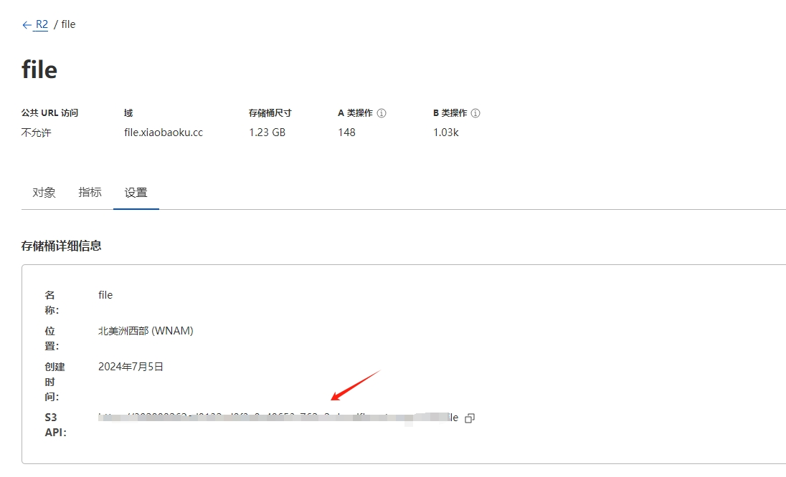
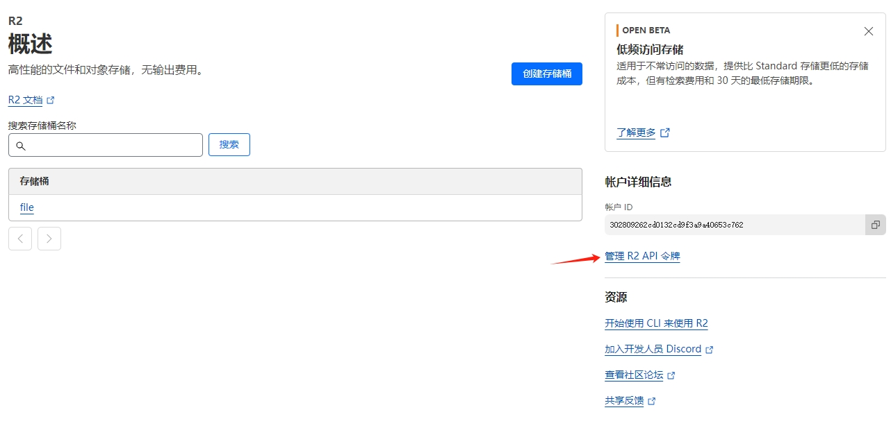
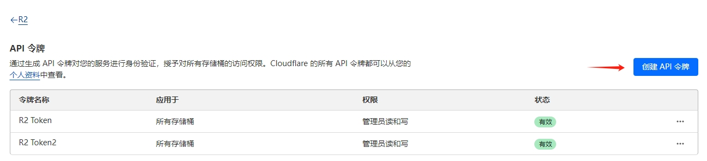
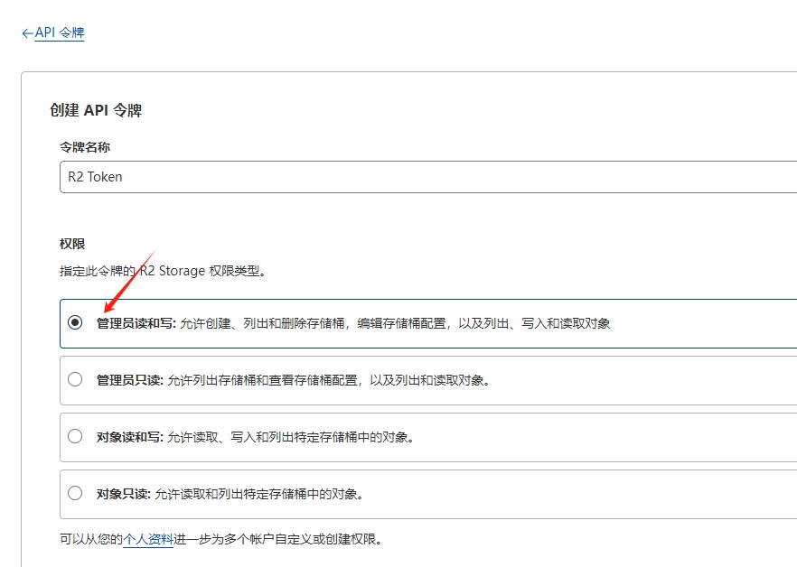
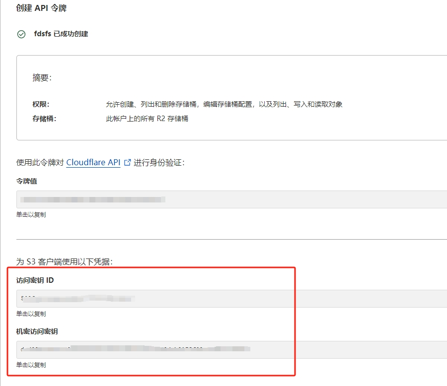
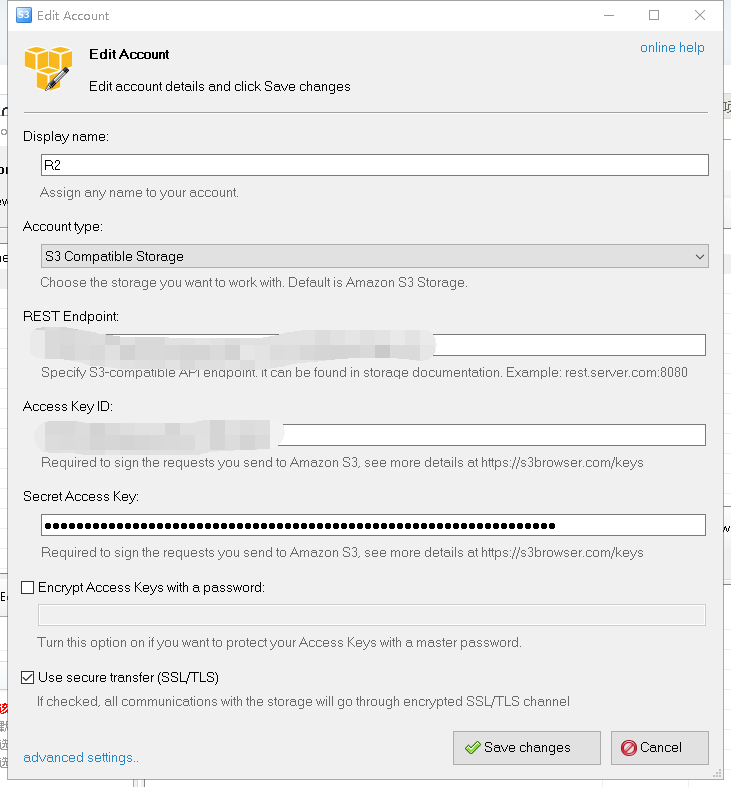
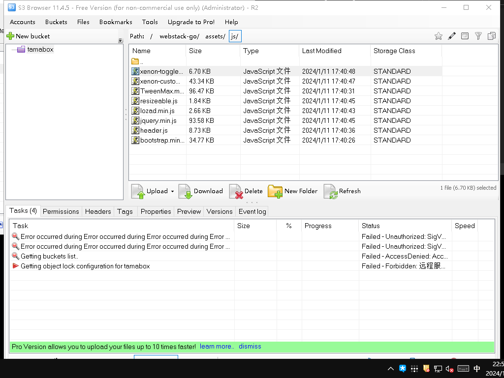

Cloudflare的R2很好用，但是网页端不能上传大于300m的文件，它是兼容AWS S3的那就用S3的方法去管理他。

需要用到<a href='https://s3browser.com/download.aspx'>S3Browser</a>这个软件，只有英文，但是不妨碍使用。安装完成之后选择Add new account。

Display Name任意填写即可，Account type选择S3 Compatible Storage，即兼容S3存储。
### 1填写S3 API
REST Endpotin对应的是S3 API的值，但是不能整个填写进去。

比如网页端显示的S3 API为：



```bash
https://xxxxxxxxxxxxxxxxxxx.r2.cloudflarestorage.com/tamabox
```

那这里要填写的是

```bash
https://xxxxxxxxxxxxxxxxxxx.r2.cloudflarestorage.com
```

### 2填写AK和SK

AK和SK是创建令牌的时候提供的，如果忘记了就没救了，重新申请一个令牌

### 3创建令牌





### 4选择管理员权限



### 5创建成功
建议保存到本地，因为只会显示一次



#### 6Encrypt Access Keys with a password和Use secure transfer(SSL/TSL)选项保留默认即可。



配置完之后点击左下角的save changes

这时候应该是能连接进R2内部了，就当作一个文件管理器操作就行了。

