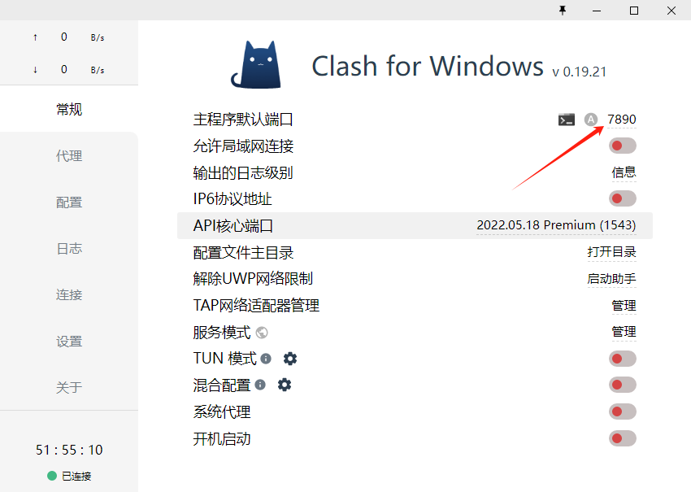
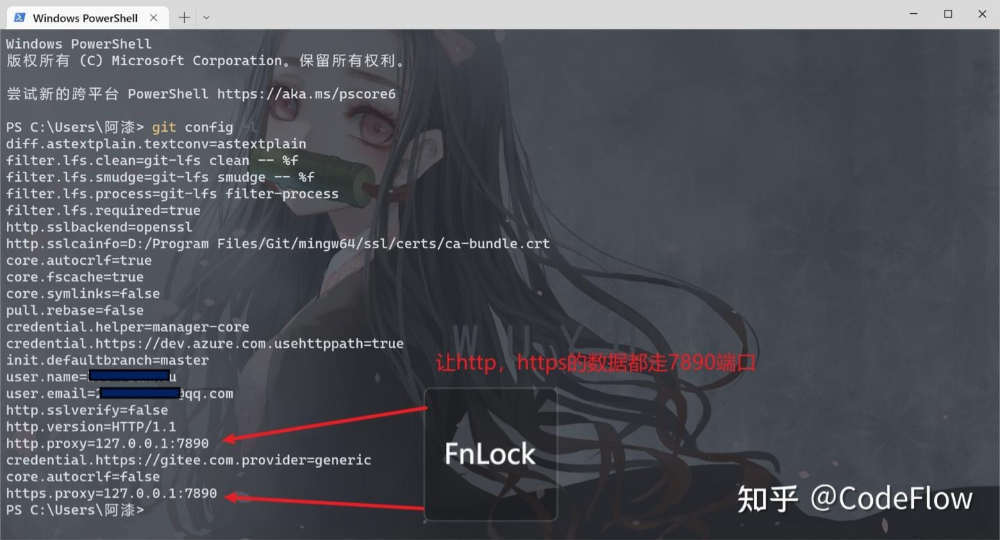

有时候我们用开了 clash 挂好了 xx，但还是经常出现 git push 显示 time out 的情况。这里要纠正一个很多人的误区：即使 clash 开了全局代理，浏览器能上油管等网站，git 默认还是不走代理的，所以会遇到超时等情况。按照我下面的配置好之后，目前 git 的各项操作都畅通无阻。


首先clash开放的是7890端口



我的git走的是https上传，但git的https却没有走这里，所以我们通过：

```bash
git config --global http.proxy http://127.0.0.1:7890

git config --global https.proxy https://127.0.0.1:7890
```
把git的代理改成clash的端口，改完了可以git config -l看看：



### ps

注意clash端口旁边的A要关掉（是可以点击的，让其置灰），clash默认随机开放端口的，要让他固定下来，然后让git走这个端口即可。


