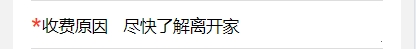
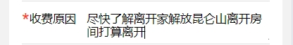

### 创建 src/directives/auto-resize.js 文件

```javascript
export default {
  mounted(el) {
    el.style.height = "auto";
    el.style.overflowY = "hidden";
    el.style.boxSizing = "border-box";

    const resizeTextarea = () => {
      el.style.height = "auto"; // 先重置高度
      el.style.height = el.scrollHeight + "px"; // 然后设置为内容高度
    };

    el.addEventListener("input", resizeTextarea);

    // 初始化高度
    resizeTextarea();

    // 将 resizeTextarea 保存为元素的属性，以便在 unmounted 中访问
    el._resizeTextarea = resizeTextarea;
  },
  unmounted(el) {
    // 从元素属性中获取并移除事件监听器
    el.removeEventListener("input", el._resizeTextarea);
    delete el._resizeTextarea;
  },
};
```

### 在 main.js 中注册全局指令

```javascript
import { createApp } from "vue";
import App from "./App.vue";
import autoResize from "./directives/auto-resize";

const app = createApp(App);

app.directive("auto-resize", autoResize);

app.mount("#app");
```

### 在.vue 中使用

```javascript
<template>
  <textarea v-auto-resize placeholder="请输入内容"></textarea>
</template>

<script>
export default {
  name: 'AutoResizeTextarea'
};
</script>

<style scoped>
textarea {
  width: 100%;
  min-height: 50px;
  box-sizing: border-box;
}
</style>
```

### 如果想实现一行的效果需要设置 rows="1"





```javascript
<textarea rows="1"></textarea>
```

