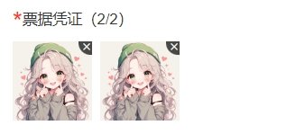

afterRead方法把file对象默认塞到formData.fileList数组中，而且file是个文件对象，塞入并没什么用，如果此时在将服务端返回的图片地址塞入formData.fileList.push({url:res.data.data.name})就出现两份一样图片了。

```javascript
<van-uploader
  v-model="formData.fileList"
  accept="image/png, image/gif, image/jpeg"
  :max-size="4 * 500 * 1024"
  :max-count="9"
  :before-read="beforeRead"
  :after-read="afterRead"
/>

afterRead() {
  //上传图片
}
```



### 解决方案

这个是为了默认提供图片预览效果，如果你不需要的话，可以把 v-model 改成 :model-value

```javascript
<van-uploader
  :model-value="formData.fileList"
  accept="image/png, image/gif, image/jpeg"
  :max-size="4 * 500 * 1024"
  :max-count="9"
  :before-read="beforeRead"
  :after-read="afterRead"
/>

afterRead() {
  //上传图片
  formData.fileList.push({
    url:'xxxxxxxxx'
  })
}
```


